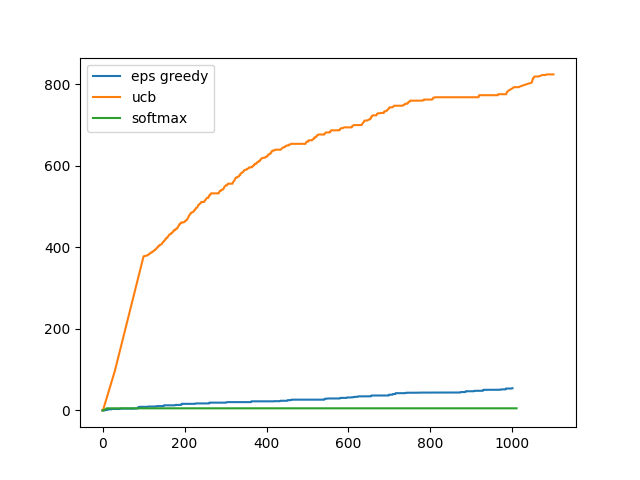
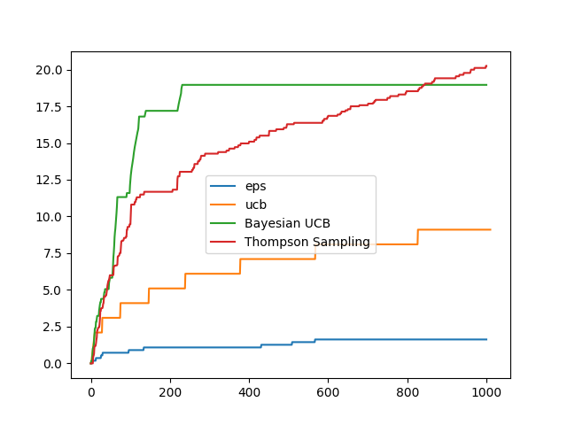

# Bandit Algorithms

JigglypuffRL currently supports multi-armed Bandits with the every arm modeled as:<br>
- Bernoulli/Beta Random Variable <br>
- Gaussian Random Variable <br>

There current list of supported Bandit Algorithms are:<br>
1. Epsilon Greedy<br>
2. Upper Confidence Bound<br>
3. Bayesian Upper Confidence Bound (only in Bernoulli/Beta RV Formulation)<br>
4. Thompson Sampling (only in Bernoulli/Beta RV formulation)<br>
5. Softmax Action Selection (only in Gaussian RV formulation)<br>

An example of the usage is as follows:

#### Import
```
from jigglypuffRL import EpsGreedyGaussianBandit, EpsGreedyBernoulliBandit, \
UCBGaussianBandit, UCBBernoulliBandit, BayesianUCBBernoulliBandit, \
ThompsonSampling, SoftmaxAction Selection
```

#### Initialize Models
```
epsGreedyBandit = EpsGreedyGaussianBandit(bandits=1, arms=10, eps=0.05)
ucbBandit = UCBGaussianBandit(bandits=1, arms=10)
softmaxBandit = SoftmaxActionSelection(bandits=1, arms=10)
```

#### Learn 
```
epsGreedyBandit.learn(n_timesteps=1000)
ucbBandit.learn(1000)
softmaxBandit.learn(1000)
```

#### Plot
```
import matplotlib.pyplot as plt

plt.plot(epsGreedyBandit.regrets, label="eps greedy")
plt.plot(ucbBandit.regrets, label="ucb")
plt.plot(softmaxBandit.regrets, label="softmax")
plt.legend()
plt.savefig("GuassianBanditsRegret.png")
plt.cla()
```

#### Initialize Bernoulli/Beta models
```
epsbernoulli = EpsGreedyBernoulliBandit(bandits=1, arms=10, eps=0.05)
ucbbernoulli = UCBBernoulliBandit(bandits=1, arms=10)
thsampling = ThompsonSampling(bandits=1, arms=10, a=1, b=1)
bayesianbandit = BayesianUCBBernoulliBandit(bandits=1, arms=10, a=1, b=1, c=3)
```

#### Learn
```
epsbernoulli.learn(1000)
ucbbernoulli.learn(1000)
thsampling.learn(1000)
bayesianbandit.learn(1000)
```

#### Plot
```
plt.plot(epsbernoulli.regrets, label="eps")
plt.plot(ucbbernoulli.regrets, label="ucb")
plt.plot(bayesianbandit.regrets, label="Bayesian UCB")
plt.plot(thsampling.regrets, label="Thompson Sampling")
plt.legend()
plt.savefig("BernoulliBanditsRegret.png")
```

This creates the following plots:

Gaussian Regrets             |  Bernoulli Regrets
:-------------------------:|:-------------------------:
  |  

